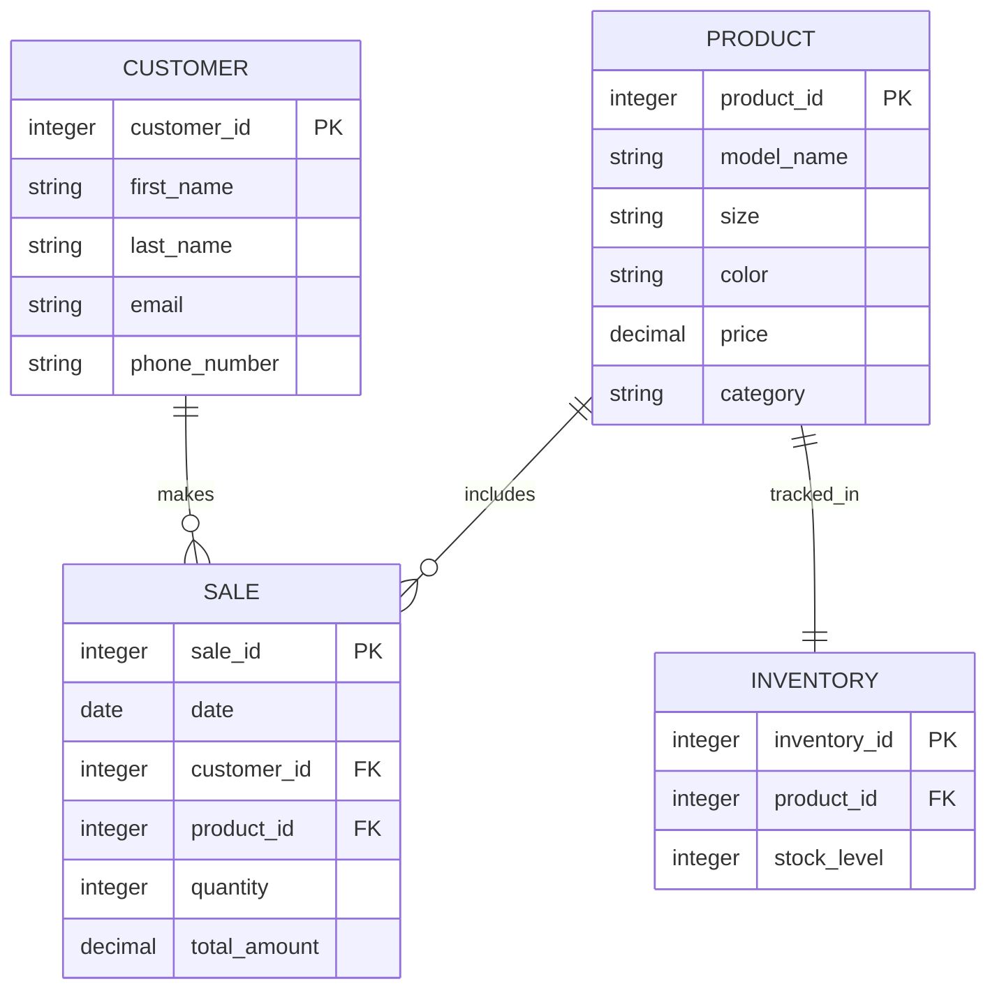

# Nike Shoe Store Entity-Relationship Diagram (ERD)

## Description of Entities and Relationships

1. **PRODUCT**: Represents various models of Nike shoes available in the store. Each product has a unique ID and attributes like name, model, price, size, and color.

2. **CUSTOMER**: Contains information about customers, including their unique ID, name, email, and phone number.

3. **SALE**: Captures transaction records that link customers to the products they purchase. It includes details such as the sale date, quantity, and total price.

4. **INVENTORY**: Tracks the stock levels of each product. It contains a unique ID for inventory records and the current stock level for each product.

### Relationships:

- A **customer** can make multiple **sales**, reflecting repeat purchases.
- Each **sale** includes one **product**, indicating that customers purchase specific shoe models.
- Each **product** is tracked in **inventory**, ensuring the store can manage stock levels effectively.
